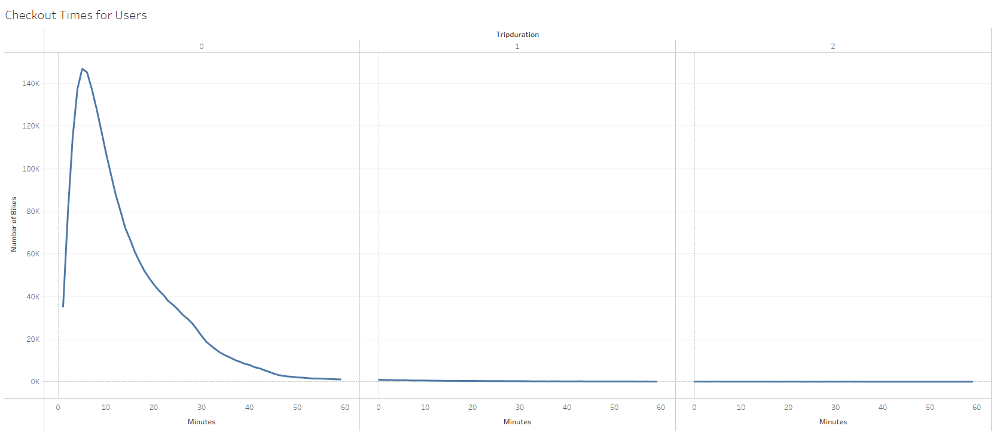
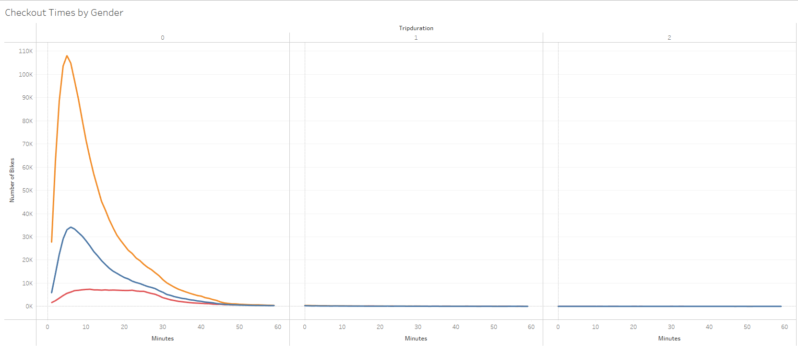
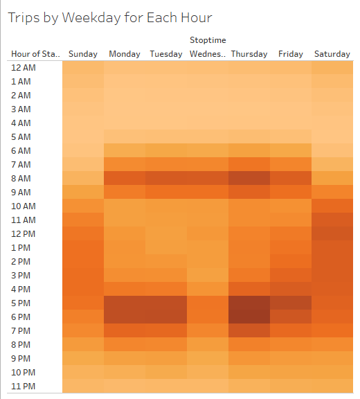
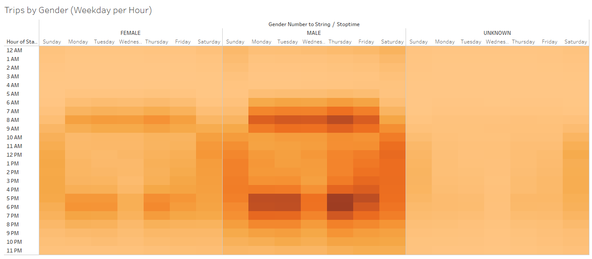
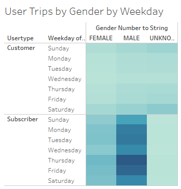

# Bikesharing Analysis
[Link to Tableau Dashboard](https://public.tableau.com/views/14-Challenge/CheckoutTimesforUsers?:language=en-US&:display_count=n&:origin=viz_share_link)

## Overview of the Statistical Analysis
The purpose of this analysis was to visualize and predict trends in regards to the length of time a bike is rented, and what the peak times of rental are throughout the week.

## Results
  
This graph shows that most rides last for just under 10 minutes and very few last over a hour.****

  
This graph displays that there are significantly more Males checking out bikes in general. It also shows that both Male and Female customers share the same peak ride length.

  
This graph shows most traffic occurs at the beginning and end of the work days, and steadly occurs throughout the day on weekends.

  
This graph shows that gender seems to have no difference on the time of day the user tends to take a bike trip.

  
Although faint, this graph does show that Subscribers tend to ride more during the week, and standard customer traffic tends to pick up slightly on the weekends.

## Summary
The results of our analysis show that while male customers tend to take more trips than females, they both tend to have the same peak times - as long as they are a subscriber to the company. There is a slight uptick in activity from non-subscriber customers on the weekend, and this could be an opportunity to target marketing to attempt to gain additional subscribers. To provide more insight on where to place this advertising, analysis could be done on the trip locations and routes taken on the weekends compared to the weekday. If a popular area such as downtown is determined advertising could be placed appropriately.
